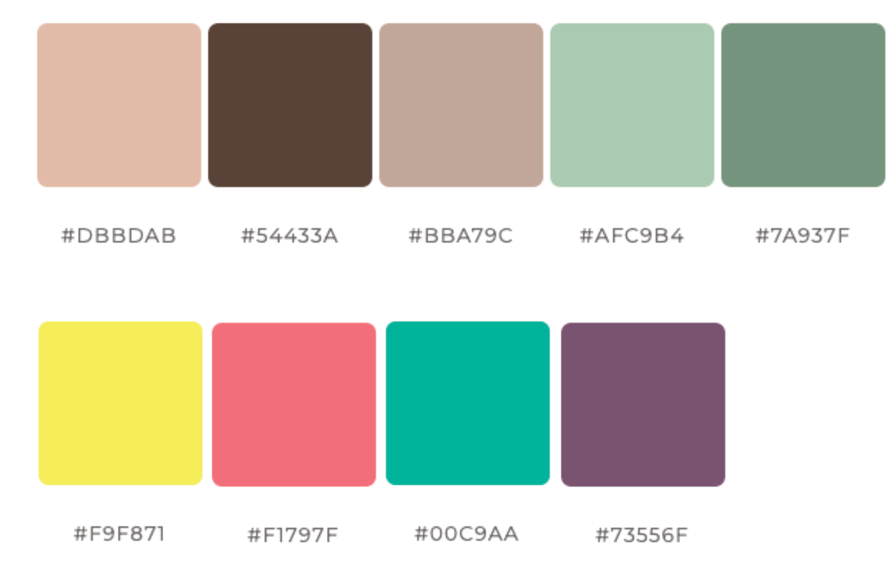
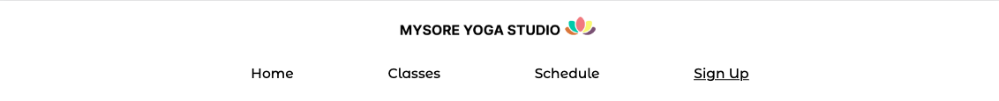
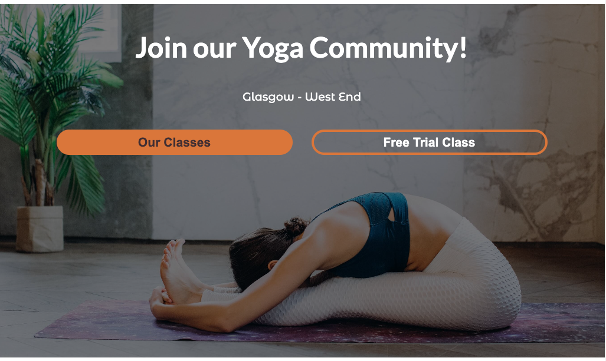
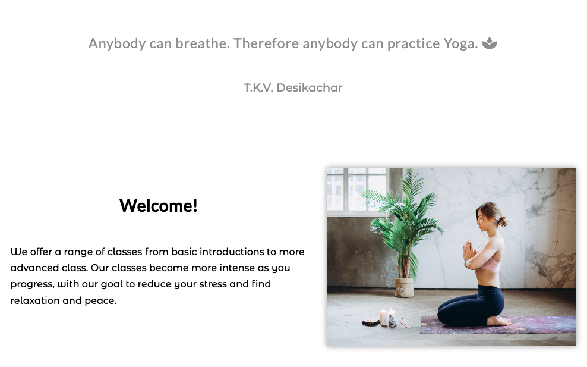
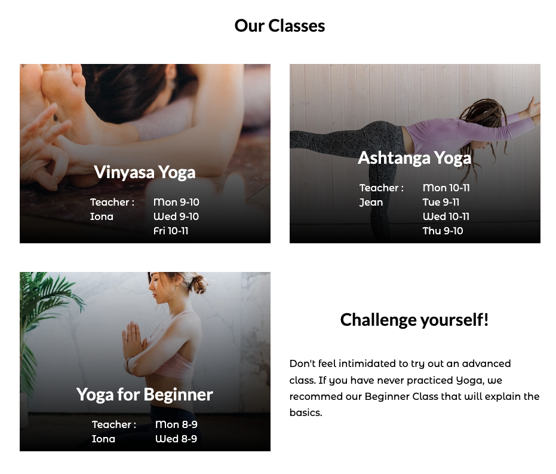
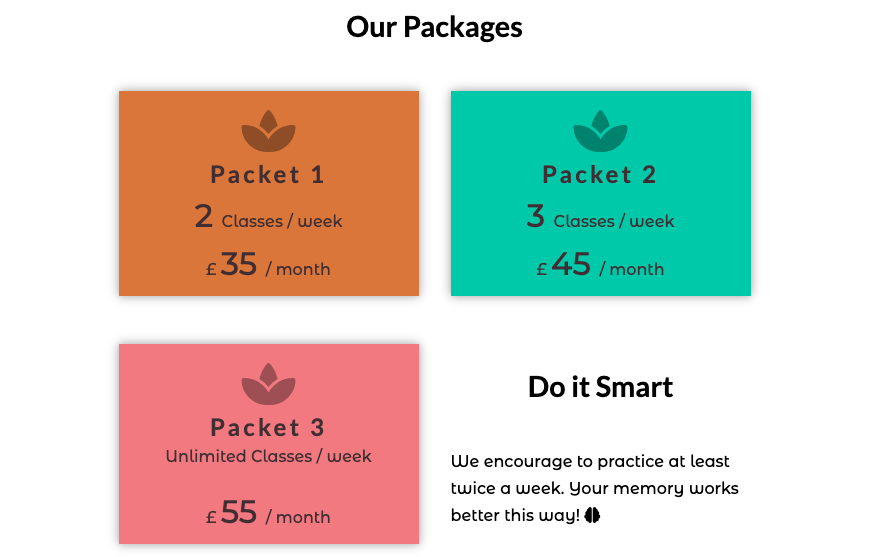
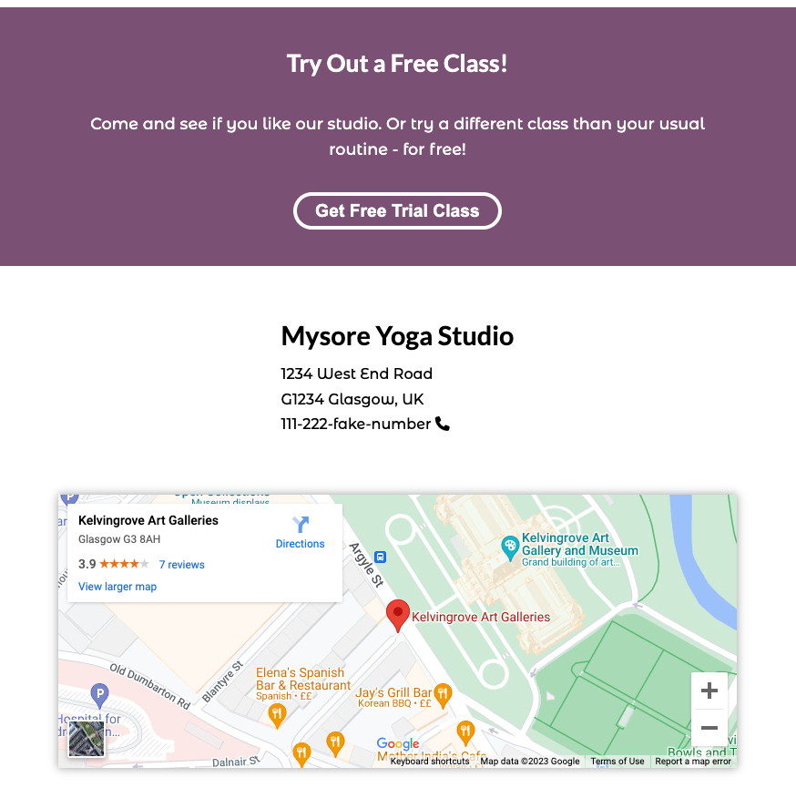
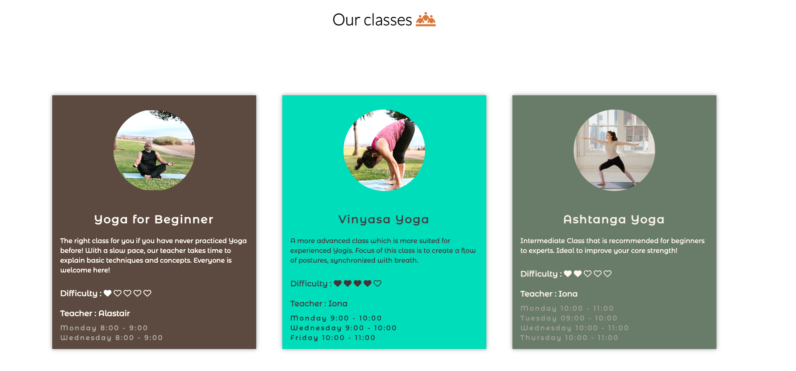
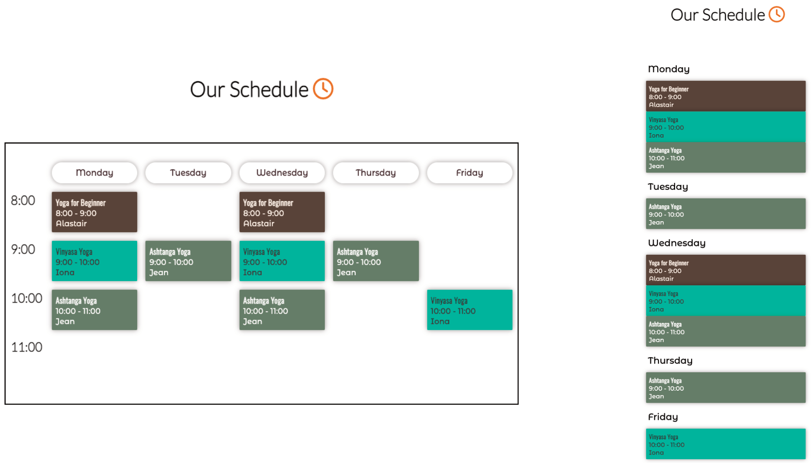
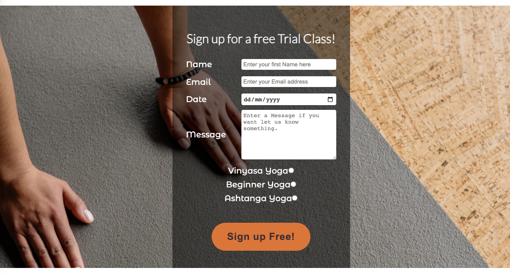

# MYSORE YOGA STUDIO 

This website targets members of an imaginary Yoga studio based in Glasgow, UK. The purpose of the studio is to provide a space where students can find relaxation and mindfulness outisde their stressful and competitive day-to-day life. The website encourages people to sign up for Yoga who have never practised Yoga before, and it provides basic information for Yoga students that are already signed up. 

Link to the live page : https://nils-n.github.io/p1-mysore-yoga-studio/

## Table of Contents 

- [User Experience](#user-experience-ux)
    - [User Stories](#user-stories)
    - [Website Aims](#website-aims)
- [Design](#design)
    - [Color Scheme](#color-scheme)
    - [Typography](#typography) 
    - [Imagery](#imagery)
    - [Wireframes](#wireframes)
- [Features](#features)
    - [General Features](#general-features)
    - [Future Implementations](#future-implementations)
    - [Accessibility](#accessibility)
- [Techologies](#technologies-used)
    - [Languages Used](#languages-used)
    - [Frameworks Used](#frameworks-used)
- [Deployment Details](#deployment-and-local-development)
    - [Deployment](#deployment)
    - [Local Development](#local-development)
        - [How to Fork](#how-to-fork)
        - [How to Clone](#how-to-clone)
- [Testing](#testing)
- [Credits](#credits)
    - [Code Used](#code-used)
    - [Content](#content)
    - [Acknowledgements](#acknowledgements)

## User Experience (UX)

### User Stories 

As a first-time user, ...
<ol>
    <li>I want to know the ethos of the studio so that i know if it matches my own ethos</li>
    <li>I want to form an expectation of the studio to that i feel motivated to try out a first class </li>
    <li> I want an overview of available classes so that i can choose an approriate first class</li>
    <li> I want to know the price of a class so that i can decide it will be worth it</li>
    <li> I want to know the location so that i know how to arrive</li>
    <li> I want to know the time schedule so that i know when to arrive</li>
    <li>I want to contact the studio via Facebook/Instagram so that i can ask further questions</li>
</ol>

As a returning user, ...
<ol>
    <li>I want to to contact the studio so that i can ask a specific question</li>
    <li>I want to get information about classes different from my current one (price, time)</li>
    <li>I want to see the schedule of classes to remind me when to be there for my class</li>
    <li>I want to see the prices of classes to remind me how much money to bring</li>
</ol>

As the site's owner,...
<ol>
    <li>I want to encourage new customers to come visit for a first class </li>
    <li>I want to keep my current customers happy and help them progress in Yoga </li>
    <li> I want to encourage current users to to enroll in additional classes</li>
    <li>I want to expand the studio so that I can hire new teachers and add new Yoga classes </li>
</ol>

### Website Aims

- Provide all required information. 
- Motivate to join and stay subscribed. 
- Provide ways to contact the studio. 
- add to overall positive experience also outside the class. 

### How these needs are addressed

- All possible user scenarios and potential needs were identified and documented. 
- The user needs to feel instantly a positive emotion and should know instantly what to expect from this website. 
- This is very important because users interested in Yoga usually try to reduce their stress - and dealing with a poorly designed website would be in contrast to the experience that they look for.  
- Contact information of various channels will be provided, i.e. via Telephone/Email and Links to Facebook/Instagram channels.

### Opportunities 

| Description                    | Impact | Feasibility       | 
|--------------------------------|--------|-------------------|
| Inform about Studio Ethos      | 5      | 5                 | 
| Inform about Location          | 5      | 5                 | 
| Inform about Schedule          | 5      | 5                 | 
| Recruit new members            | 5      | 5                 | 
| Keep current members           | 5      | 5                 | 
| ~~Send reminders and updates~~ | 4      | 1                 | 
| **Sum**                          | **25**   | **25**         | 

### Feature selection

The sum of Impact/Feasibility is balanced after discarding the entry "Send reminders and updates". This had to be discarded because it is currently not feasible with my current knowledge of CSS/HTML in the targeted time frame. This feature would be addressed in a future release when I have advanced in the class.

## Design

### Color Scheme

A harmonic color scheme was chosen in order to match the theme of a mindful-centered website. Warm, earth tones were chosen to create a warm, comforting atmosphere. In addition, a small set of lively colors add a contrast to the earthly tones in order to make the page more lively and vital - also to express the studio's message of a balanced life style. 

All color tones have been taken using a color picker from the hero image using the color palette generator [Link to Acknowledgements](#acknowledgements). 

### Typography

Fonts were selected to create a professional, classic and smooth impression. Balanced contrast was selected to create a harmony that is in line with the site's goal of a relaxed and mindful work-life balance. Font pairs were then generated using deep learning-based approach using [Fontjoy](https://fontjoy.com/). In the final website, fonts were imported via [Google Fonts](https://fonts.google.com/).
- Lato (Light 300) was chosen for the Heading (H1)
- Montserrat Alternates (Medium 500) was chosen for the body text on the site
- Oswald (Regular 400) was chosen for Headings h2-h6

### Imagery 

###  Prototype of the Page using Wireframes

Wireframes were generated using [Balsamiq](https://balsamiq.com/) for mobile and desktop displays using a mobile-first approach.  

[Wireframe for the Homepage](/assets/documentation/page1-home.png)

[Wireframe for the Classes Page](assets/documentation/page2-classes.png)

[Wireframe for the Signup Page](assets/documentation/page3-signup.png)

###  Layout and Refinement of the Wireframe using Figma 

The layout of the page was then refined using [Figma](https://figma.com/). The layout was created both for mobile and desktop displays, with a mobile-first approach.

 During this refinement phase, it has turned out that it would be best to separate the Yoga schedule from the class description page and separate the schedule information from the Classes page and create a new page for it.  

[Wireframe for the Homepage](/assets/documentation/wireframe-1-main.png)

[Wireframe for the Classes Page](assets/documentation/wireframe-2-classes.png)

[Wireframe for the Schedule Page](assets/documentation/wireframe-3-schedule.png)

[Wireframe for the Signup Page](assets/documentation/wireframe-4-signup.png)

## Features 

### General Features 

The website consits of a home page, a classes pages, a schedule page and a signup page. Each page has a Favicon icon in the browser tab, a navigation bar and a footer. All Pages are responsive. 

-------
### Main Page 

#### Navigation Bar

- Present on all pages and includes a logo of the studio and links to the Home Page, Classes Page, Schedule Page and Signup Page. 
- When hovering over an Element, the color changes. 
- The current page is always underlined. 

#### Hero Image

- The hero image is presented on the landing page and has a welcoming message, a location, and two Call-to-actions (CTA). 
- The first CTA encourage the new users to sign upfor a free trial class
- The second CTA directs to the Classes Page 
- The buttons are placed on top of an image of a Yoga student in a relaxing pose 

#### Welcome Message 
- A short section with a quote from a famous Yoga person and a welcome message. 
- This section is intended to express the ethos of the studio featuring relaxation and peace. 

#### Classes Overview Section
- A section with an overview of the offered classes including time information, and teacher name. 
- Each class can be clicked on and the user gets directed to the classes page 
- The layout of this section aimes to be a light, playful invitation to the user to look for more details 

#### Prices Section
- This one was difficult to design : On one hand, Yoga is meant to be non-materialistic and money should not play a major role. But on the other hand, the user is very much interested in this information! 
- A solution to this problem was to create contrasting, playful and colorful section that is nice to look at while still being part of the Main Page

#### Contact Section 
- This section conveys the location by embedding a google maps location and writing the actual address, and a telephone number 
- Another CTA is embedded to further encourage the user to sign up for a free trial 

#### Footer Section

- The footer contains links to Facebook, Instagram , Twitter and a copyright message
- Since the Yoga studio does not exist, these link open the main page of Facebook, etc.
- The style of the footer is minimal, and the links are icons within a circle 

-------

#### Yoga Classes Page 

- This page contains detail information about each of the 3 classes that are offered in the Studio 
- Each Class is within a colored box and contains information such A Summary of the Techniques, Difficulty Level, Teacher Name and Time of the Class
- As a feature, each Class is associated with a color. 
- When the user navigate from this page to the Schedule Page, they will find the same colors of the class in the Week Schedule guiding them visually to the information they want

-------

#### Schedule Page 

- This page contains the Weekly Yoga Schedule from Monday to Friday, including information about Begin and End of Class, and the Teacher 
- The classes are additionally couloured using the same colour of the Classes Page to help users visually to find the information they are looking for (when a particular class happens)
- On large screens, this information is displayed as Schedule Grid, on mobile screen the grid gets stacked to account for smaller screen size 

-------

#### Signup Page 

- This page contains a backkground image from the Yoga Studio and an interactive Form where user can sign up for a free Trial
- This is intended for new users to try the Studio for the first time, and for current users to sign up for a differnent class than their usual routine 
- The users leave their Name, Email and an optional Message, and inform the studio about the day they want to try out the class, and which class they want to visit 

-------

### Future Implementations

- User login to personalize the experience.
- receive offers and reminders for Yoga classes.
- booking and managing classes online.
- feedback to specific teachers or classes.
- interactive feature i.e. a guest book.
- online shop for supporting material (i.e. Yoga mats, Yoga cloths) or Yoga vacations/workshops.

#### User section 

### Accessibility

- The website has been made to pass WAVE WebAIM Accesibility Check
- Color Contrast was aimed to match minimum acceptance criteria Accessibility Validation of the [A11y Color Contrast Accessibility Validator](https://color.a11y.com/Contrast/) Framework
- All Links have been added an `aria-label` to ensure readibility for visually impaired users of the website 
- Headings ELements `h1`, `h2`, and `h3` have been applied to convey structure
- The pages are strucutred with `section`, `header`, `nav` and `footer` Html elements using semantic Html 
- Every `img` element has been given an `alt` attribute. Image elements, such as Hero image, which were implemented as background images within CSS have been linked to a heading via `aria-labelledby` property of the division containing the background image. 

## Technologies Used 

- GitPod as IDE [Link](https://www.gitpod.io/)
- Git / GitHub  for Version Control [Link] (https://github.com/)
- Figma for Wireframs [Link](https://www.figma.com/)
- Mac OS Image Preview Tool for cropping and resizing Images 
- Google Maps for display of a GPS location [Link](https://maps.google.com/)
- Favicon for making a browser Icon [Link](https://favicon.io/favicon-converter/)
- W3 Validation Tools for Testing [Link](https://validator.w3.org/)
- Shields.io for adding badges this Readme file [Link](https://shields.io/)

### Languages Used

- HTML 
- CSS 

### Frameworks Used
- N/A

## Deployment and Local Development 

### Deployment 

This website was deployed via GitHub Pages using the main branch: [Link to live Website](https://nils-n.github.io/p1-mysore-yoga-studio/). The following steps were followed: 

- Log into GitHub and navigate to this repository  
- Click on "Settings" Button 
- Click on "Pages" button 
- Select main brach as Source and Save. After a few minutes, the website should be live. 

### Local Development

#### How to Fork

- Log into GitHub and navigate to this repository  
- Click on the "Main" Branch button and type the name of the forked branch
- Click on "Create Branch" to confirm

#### How to Clone

- Click on the "Code" button and copy the link to this repository
- open terminal on your machine and navigate to the folder you want to store a local copy
- in the terminal, type 'git clone ' followed by the link you copied
- press enter to confirm

---- 

## Testing 

- The website was tested extensively for : 
     - Functionality
     - User Stories
     - Usability and Accessibility 
     - Compatibility and Responsiveness 
- Results are documented in a dedicated Markdown File
     -   Link to the Results : [TESTING.md](./TESTING.md)

---- 

## Credits 

### Code Used

- Github badges from [Shields.io](https://shields.io/)
- Tips for Sticky Headers [dev.to/akhilarjun](https://dev.to/akhilarjun/one-line-sticky-header-using-css-5gp3)
- Flexbox Navigation Bar example from Code Institute  [Slack](https://slack.com/) Channel  (Sean_ci, "How to easily create a Navigation Menu with Flexbox", 16th Feb 2022)
- Tipps how to style Hero image [Link To Website](https://blog.hubspot.com/marketing/hero-image)
- Tipps on how to use Grid to create a schedule [CSS Tricks](https://css-tricks.com/building-a-conference-schedule-with-css-grid/)
- Tipp on how to make layout with multiple columns responsive [Stackoverflow](https://stackoverflow.com/questions/56045114/flexbox-layout-with-two-columns-on-desktop-and-one-column-on-mobile)
- Code example to make footer stick to the bottom of the page [CSS Tricks](https://css-tricks.com/couple-takes-sticky-footer/)
- Code for semantic CSS selectors inspired by [Kevin Powell's Youtube Video](https://www.youtube.com/watch?v=lWu5zf_S9R4) 
- Excel Template for Website Testing [Link to Page](https://www.guru99.com/download-sample-test-case-template-with-explanation-of-important-fields.html)

### Content 

All of the content was written by myself and is fictionary and has no reference to any exisiting place. 

### Acknowledgements
- Teaching and Support from Code Insitute [Code Insitute](https://codeinstitute.net/)
- Example Readme from Kera Cudmore [Kera's Github](https://github.com/kera-cudmore/readme-examples/blob/main/milestone1-readme.md)
- Love Running Example [Love Running Example](https://github.com/Code-Institute-Solutions/readme-template)
- Color Palette Generator from [Mycolor.space](https://mycolor.space/)
- Font Generator from  [Fontjoy](https://fontjoy.com/)
- Fonts from [Google Fonts](https://fonts.google.com/) 
- Images from  [Pexels](https://pexels.com/) : 
    - Elina Fairytale (Photographer)
    - RODNAE Productions (Photographer)
    - Yan Krukau (Photographer)
- Kevin Powell's excellent [Youtube](https://www.youtube.com/@KevinPowell) Channel: 
    - How to approach a design layout with Figma [Youtube Link](https://youtu.be/KYFwcIRx16g)
    - Tips for CSS flexbox [ Youtube Link](https://youtu.be/rg7Fvvl3taU) and  [ Youtube Link](https://youtu.be/JnTPd9G6hoY)
    - More Tricks for flexbox and grod [Youtube Link](https://youtu.be/JHregeIsjPQ)
    - How to move from Figma to CSS [Youtube Link](https://youtu.be/NB1mn2YVF8Q)
    - Semantic CSS [Youtube Link](https://www.youtube.com/watch?v=lWu5zf_S9R4)
- Last but not least : Excellent advices from my mentor Ronan (Code Institute) 

