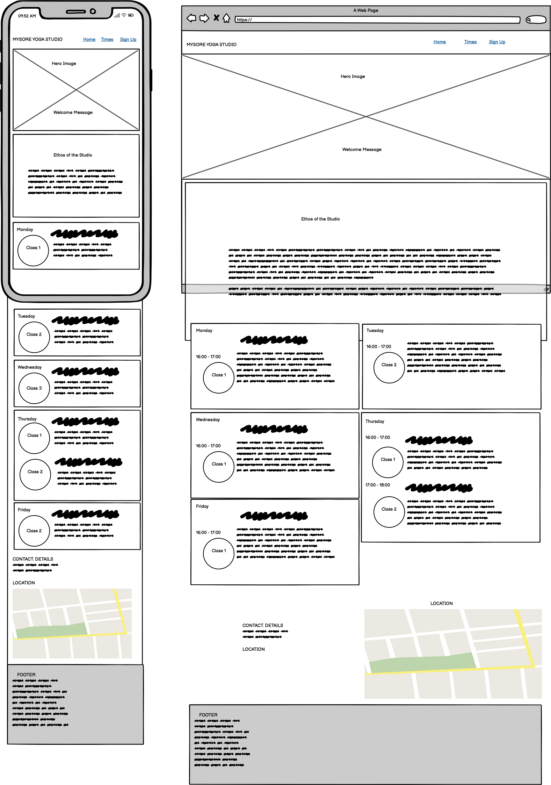
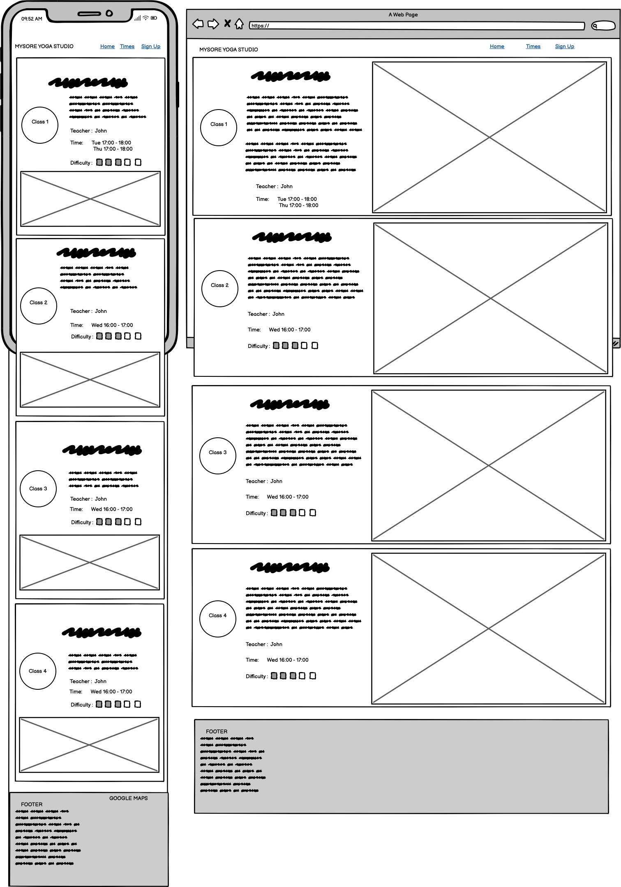
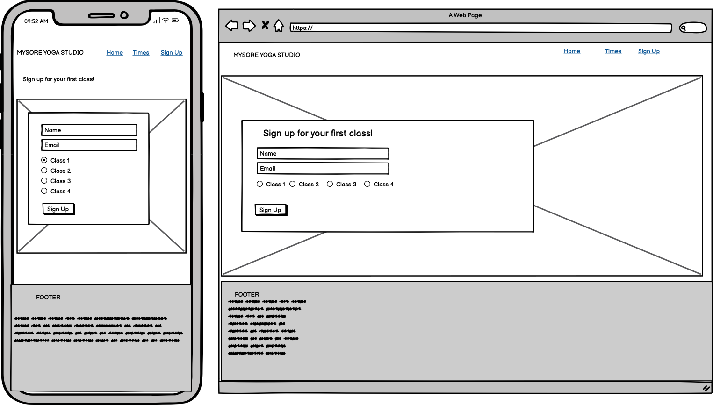

# MYSORE YOGA STUDIO 

This website targets members of an imaginary Yoga studio based in Glasgow, UK. The purpose of the studio is to provide a space where students can find relaxation and mindfulness outisde their stressful and competitive day-to-day life. The website encourages people to sign up for Yoga who have never practised Yoga before, and it provides basic information for Yoga students that are already signed up. 

Link to the live page : https://nils-n.github.io/p1-mysore-yoga-studio/

## Table of Contents 

- [User Experience](#user-experience-ux)
    - [User Stories](#user-stories)
    - [Website Aims](#website-aims)
- [Design](#design)
    - [Color Scheme](#color-scheme)
    - [Typography](#typography) 
    - [Imagery](#imagery)
    - [Wireframes](#wireframes)
- [Features](#features)
    - [General Features](#general-features)
    - [Future Implementations](#future-implementations)
    - [Accessibility](#accessibility)
- [Techologies](#technologies-used)
    - [Languages Used](#languages-used)
    - [Frameworks Used](#frameworks-used)
- [Deployment Details](#deployment-and-local-development)
    - [Deployment](#deployment)
    - [Local Development](#local-development)
        - [How to Fork](#how-to-fork)
        - [How to Clone](#how-to-clone)
- [Testing](#testing)
- [Credits](#credits)
    - [Code Used](#code-used)
    - [Content](#content)
    - [Media](#media)
    - [Acknowledgements](#acknowledgements)

## User Experience (UX)

### User Stories 

As a first-time user, ...
<ol>
    <li>I want to know the ethos of the studio so that i know if it matches my own ethos</li>
    <li>I want to form an expectation of the studio to that i feel motivated to try out a first class </li>
    <li> I want an overview of available classes so that i can choose an approriate first class</li>
    <li> I want to know the price of a class so that i can decide it will be worth it</li>
    <li> I want to know the location so that i know how to arrive</li>
    <li> I want to know the time schedule so that i know when to arrive</li>
    <li>I want to contact the studio via Facebook/Instagram so that i can ask further questions</li>
</ol>

As a returning user, ...
<ol>
    <li>I want to to contact the studio so that i can ask a specific question</li>
    <li>I want to get information about classes different from my current one (price, time)</li>
    <li>I want to see the schedule of classes to remind me when to be there for my class</li>
    <li>I want to see the prices of classes to remind me how much money to bring</li>
</ol>

As the site's owner,...
<ol>
    <li>I want to encourage new customers to come visit for a first class </li>
    <li>I want to keep my current customers happy and help them progress in Yoga </li>
    <li> I want to encourage current users to to enroll in additional classes</li>
    <li>I want to expand the studio so that I can hire new teachers and add new Yoga classes </li>
</ol>

### Website Aims

- Provide all required information. 
- Motivate to join and stay subscribed. 
- Provide ways to contact the studio. 
- add to overall positive experience also outside the class. 

### How these needs are addressed

- All possible user scenarios and potential needs were identified and documented. 
- The user needs to feel instantly a positive emotion and should know instantly what to expect from this website. 
- This is very important because users interested in Yoga usually try to reduce their stress - and dealing with a poorly designed website would be in contrast to the experience that they look for.  
- Contact information of various channels will be provided, i.e. via Telephone/Email and Links to Facebook/Instagram channels.

### Opportunities 

| Description                    | Impact | Feasibility       | 
|--------------------------------|--------|-------------------|
| Inform about Studio Ethos      | 5      | 5                 | 
| Inform about Location          | 5      | 5                 | 
| Inform about Schedule          | 5      | 5                 | 
| Recruit new members            | 5      | 5                 | 
| Keep current members           | 5      | 5                 | 
| ~~Send reminders and updates~~ | 4      | 1                 | 
| **Sum**                          | **25**   | **25**         | 

### Feature selection

The sum of Impact/Feasibility is balanced after discarding the entry "Send reminders and updates". This had to be discarded because it is currently not feasible with my current knowledge of CSS/HTML in the targeted time frame. This feature would be addressed in a future release when I have advanced in the class.

## Design

### Color Scheme

A harmonic color scheme was chosen in order to match the expectation of a mindful-themed website. Warm, earth tones were chosen to create a warm, comforting atmosphere. The basic tone was taken using a color picker from the hero image using the color palette generator [Link to Acknowledgements](#acknowledgements)

### Typography

Fonts were selected to create a professional, classic and smooth impression. Balanced contrast was selected to create a harmony that is in line with the site's goal of a relaxed and mindful work-life balance. Font pairs were then generated using deep learning-based approach using [Fontjoy](https://fontjoy.com/). In the final website, fonts were imported via [Google Fonts](https://fonts.google.com/).
- Lato (Light 300) was chosen for the Heading (H1)
- Montserrat Alternates (Medium 500) was chosen for the body text on the site
- Oswald (Regular 400) was chosen for Headings h2-h6

### Imagery 

###  Prototype of the Page using Balsamiq

Wireframes were generated using [Balsamic Wireframe](https://balsamiq.com/) for mobile and desktop displays using a mobile-first approach.  

#### Home Page

#### Yoga Classes Page

#### Signup Page
>

### Refined Wireframes With Figma 

>

## Features 

### General Features 

#### Navigation Bar
#### Hero Image
#### Studio Ethos Section
#### Yoga Schedule Section
#### Footer Section

#### Yoga Classes Page 
##### Class 1 - Yoga for Beginners 
##### Class 2 - Vinyasa I 
##### Class 3 - Vinyasa II
##### Class 4 - Ashtanga I 
##### Class 5 - Ashtanga II 

#### Signup Page 
##### This page is to allow new users to sign up for a first free try-out Yoga class. 

### Future Implementations

- User login to personalize the experience.
- receive offers and reminders for Yoga classes.
- booking and managing classes online.
- feedback to specific teachers or classes.
- interactive feature i.e. a guest book.
- online shop for supporting material (i.e. Yoga mats, Yoga cloths) or Yoga vacations/workshops.

#### User section 

### Accessibility

## Technologies Used 

- GitPod as IDE [Link](https://www.gitpod.io/)
- Git / GitHub  for Version Control [Link] (https://github.com/)
- Figma for Wireframs [Link](https://www.figma.com/)
- Mac OS Image Preview Tool for cropping and resizing Images 
- Google Maps for display of a GPS location [Link](https://maps.google.com/)
- Favicon for making a browser Icon [Link](https://favicon.io/favicon-converter/)
- W3 Validation Tools for Testing [Link](https://validator.w3.org/)
- Shields.io for adding badges this Readme file [Link](https://shields.io/)

### Languages Used

- HTML 
- CSS 

### Frameworks Used
- N/A

## Deployment and Local Development 

### Deployment 

This website was deployed via GitHub Pages using the main branch: [Link to live Website (PLACEHOLDER)](#deployment). The following steps were followed: 

- Log into GitHub and navigate to this repository  
- Click on "Settings" Button 
- Click on "Pages" button 
- Select main brach as Source and Save. After a few minutes, the website should be live. 

### Local Development

#### How to Fork

- Log into GitHub and navigate to this repository  
- Click on the "Main" Branch button and type the name of the forked branch
- Click on "Create Branch" to confirm

#### How to Clone

- Click on the "Code" button and copy the link to this repository
- open terminal on your machine and navigate to the folder you want to store a local copy
- in the terminal, type 'git clone ' followed by the link you copied
- press enter to confirm

## Testing 

- HTML
    - No erros returned when testing with W3C validator 

Add here a link to the [TESTING.md (PLACEHOLDER)](#testing) file. 

## Credits 

### Code Used

- Github badges from [Shields.io](https://shields.io/)
- Tips for Sticky Headers [dev.to/akhilarjun](https://dev.to/akhilarjun/one-line-sticky-header-using-css-5gp3)
- Flexbox Navigation Bar example from Code Institute  [Slack](https://slack.com/) Channel  (Sean_ci, "How to easily create a Navigation Menu with Flexbox", 16th Feb 2022)
- Tipps how to style Hero image [Link To Website](https://blog.hubspot.com/marketing/hero-image)
- Tipps on how to use Grid to create a schedule [CSS Tricks](https://css-tricks.com/building-a-conference-schedule-with-css-grid/)
- Tipp on how to make layout with multiple columns responsive [Stackoverflow](https://stackoverflow.com/questions/56045114/flexbox-layout-with-two-columns-on-desktop-and-one-column-on-mobile)
- Code example to make footer stick to the bottom of the page [CSS Tricks](https://css-tricks.com/couple-takes-sticky-footer/)

### Content 

All of the content was written by myself and is fictionary and has no reference to any exisiting place. 

### Media 

### Acknowledgements
- Teaching and Support from Code Insitute [Code Insitute](https://codeinstitute.net/)
- Example Readme from Kera Cudmore [Kera's Github](https://github.com/kera-cudmore/readme-examples/blob/main/milestone1-readme.md)
- Love Running Example [Love Running Example](https://github.com/Code-Institute-Solutions/readme-template)
- Color Palette Generator from [Mycolor.space](https://mycolor.space/)
- Font Generator from  [Fontjoy](https://fontjoy.com/)
- Fonts from [Google Fonts](https://fonts.google.com/) 
- Images from  [Pexels](https://pexels.com/) : 
    - RODNAE Productions (Photographer)
    - Yan Krukau (Photographer)
- Wireframes from [Balsamic](https://balsamiq.com/) 
- Kevin Powell's excellent [Youtube](https://www.youtube.com/@KevinPowell) Videos: 
    - How to approach a design layout with Figma [Youtube Link](https://youtu.be/KYFwcIRx16g)
    - Tips for CSS flexbox [ Youtube Link](https://youtu.be/rg7Fvvl3taU) and  [ Youtube Link](https://youtu.be/JnTPd9G6hoY)
    - More Tricks for flexbox and grod [Youtube Link](https://youtu.be/JHregeIsjPQ)
    - How to move from Figma to CSS [Youtube Link](https://youtu.be/NB1mn2YVF8Q)
    - Semantic CSS [Youtube Link](https://www.youtube.com/watch?v=lWu5zf_S9R4)
- Code Insitute Mentor Support 

