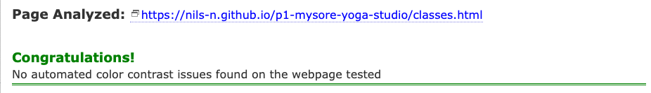

# TESTING 
The original Excel Testing document can be accessed via [Excel Testing Results](/assets/testing/yoga-studio-test-results.csv).

-----

## Table of Contents 

- [Tests for Functionality ](#tests-of-functionality)
    - [Results W3C HTML Validation](#results-w3c-html-validation)
    - [Results W3C CSS (Jigsaw) Validation ](#results-w3c-css-validation)
    - [Results A11y Color Test](#results-a11y-color-test)
- [Tests of User Stories  ](#tests-of-user-stories)
- [Tests for Usability   ](#tests-for-usability)
- [Tests for Compatibility ](#tests-for-compatibility)

-----

## Tests of Functionality 

First, the website has been tested that it works functionally correct. All testes have passed.

### Results W3C HTML Validation

In the table below the outputs of the W3C HTML Validation results. All tests passed. 

| Page     | Output       | Result |
| -------- |:------------:| ------:|
| Main     |   | Pass   |
| Classes  |     | Pass   |
| Schedule |    | Pass   |
| Signup   |    | Pass   |

### Results W3C CSS Validation

In the table below the outputs of the W3C CSS Validation results. All tests passed. 

| Page     | Output       | Result |
| -------- |:------------:| ------:|
| Main     |   | Pass   |
| Classes  |     | Pass   |
| Schedule |    | Pass   |
| Signup   |    | Pass   |

### Results A11y Color Test

In the table below the outputs of the A11y Color Contrast Validation results of the main color contrasts of the website.

| Page     | Output       | Result |
| -------- |:------------:| ------:|
| Colors   |   | Pass   |
| Colors  |     | Pass   |

In the table the output of the A11y Color Contrast Validation results of each page. All tests passed. 

| Page     | Output       | Result |
| -------- |:------------:| ------:|
| Main   |   | Pass   |
| Classes  |     | Pass   |
| Schedule  |     | Pass   |
| Signup  |     | Pass   |

## Tests of User Stories 

The user stories have been tested case-by-case. All tests passed. 

-----

## Tests for Usability 

The website has also been tested for usability and consistency across pages, and also that all links have an appropriate aria-label for accessibility. All tests passed. 

-----

## Tests for Compatibility 

The website has been tested for compatibility between browsers, and that the website is responsive and displays correctly on all screen sizes as specified during the design stage. 

